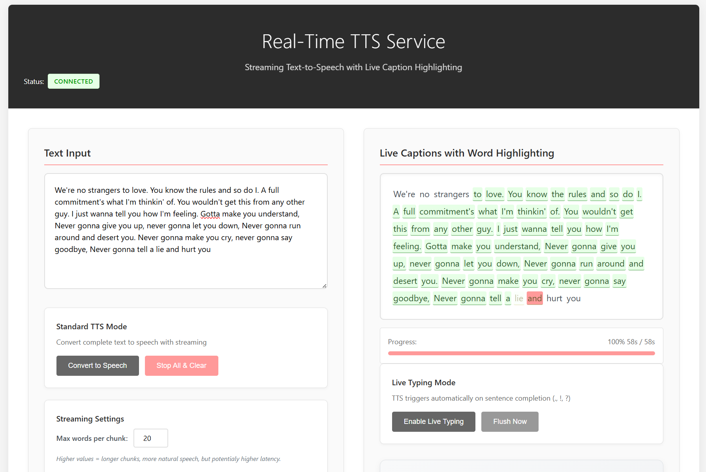

# Real-Time TTS WebSocket Service

A low-latency streaming Text-to-Speech service with real-time caption highlighting.


## Quick Start

1. **Clone the Repository**:
   ```bash
   git clone https://github.com/deeprodge/streaming_tts
   cd streaming_tts
   ```

2. **Install Dependencies**:
   ```bash
   conda create -n streaming_tts python=3.10
   conda activate streaming_tts
   pip install -r requirements.txt
   ```

3. **Run the Server**:
   ```bash
   python main.py
   ```

4. **Open Browser**:
   Navigate to `http://localhost:8000`

## Project Overview

This application provides real-time text-to-speech conversion with synchronized caption highlighting. It features two distinct modes for different use cases:

1. **Live Typing Mode**: Real-time TTS as you type, triggered on sentence boundaries
2. **Standard TTS Mode**: Convert complete text passages with streaming audio



## Key Features

- **Real-time TTS**: Low-latency text-to-speech using kokoro library
- **Live Captioning**: Word-level caption highlighting synchronized with audio *(Currently buggy - see Known Issues)*
- **Multiple Modes**: Live Typing and Standard TTS modes
- **Mathematical Notation**: Support for mathematical expressions and symbols
- **Streaming Architecture**: Progressive audio generation for faster response
- **CD-Quality Audio**: 44.1 kHz, 16-bit, mono PCM output format

## Usage Modes

### Live Typing Mode
Type text and get TTS on sentence boundaries (., !, ?). Ideal for interactive applications.

**Controls:**
- **Enable Live Typing**: Toggle Live Typing mode
- **Flush Now**: Manually trigger TTS for pending text

### Standard TTS Mode
Convert complete text input into speech with streaming capabilities.

**Controls:**
- **Convert to Speech**: Trigger TTS for all text in input area
- **Stop All & Clear**: Stop audio playback and clear content

## UI Components

### Text Input Area
Main text entry area for content to be converted to speech.

### Settings
- **Max words per chunk**: Adjust chunking size (5-50 words)
- **Volume Slider**: Adjust playback volume (0-100%)
- **Queue Display**: Number of audio chunks waiting to play
- **Latency Display**: Current latency measurement in milliseconds

### Quick Examples
Predefined text examples organized by category:
- Mathematical Notation
- Greek Letters & Symbols
- Scientific & Physics
- Normal English

### Session Statistics
- **Characters**: Total characters processed
- **Audio Chunks**: Number of audio chunks generated
- **Avg Latency**: Average latency across operations
- **Session Time**: Duration of current session

## Technology Stack

- **Backend**: Python 3.10, FastAPI, WebSockets
- **TTS Engine**: kokoro library with phoneme-level timing
- **Frontend**: Vanilla JavaScript, Web Audio API
- **Audio**: Real-time PCM streaming with word-level highlighting


## ⚠️ Known Issues

**Live Caption Highlighting**: The word-level highlighting feature is currently experiencing synchronization issues and may not work reliably in all scenarios. I'm actively working on resolving these issue.
